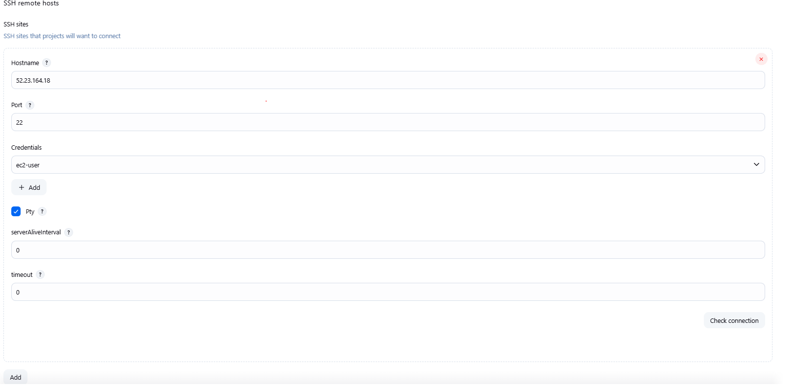
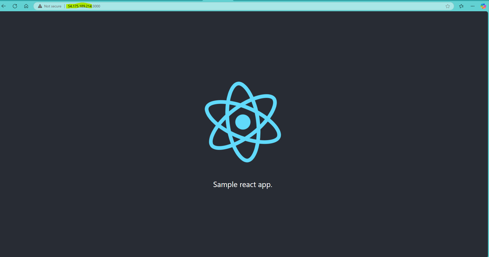

# shared-pipeline

### prerequisites to use this library :
- adding the library in global system settings in jenkins 
- docker destop needed to be installed on your machine 
- an EC2 machine needs to be spinned up on aws account and this needs to be added in the ssh connection in jenkins system configuration (ec2 connection details needs to be updated):
- Dashboard>Manage Jenkins>System




- needs to install docker and git on ec2 machine .

- needs to setup sonar , i have used sonarqube cloud platform and given that properties in my application

- needs to add required credentials in jenkins

- need to add cicd-config.yaml 
```
version : 1.0.0
deploymenttype : eks
sonarscan : true
imagescan : true
buildtype : npm
ecsdeployment: true
```

- if ecs deployment you also need to add the below files :

```
#ecs-trust-policy.json
{

  "Version": "2012-10-17",
  "Statement": [
    {
      "Effect": "Allow",
      "Principal": {
        "Service": "ecs-tasks.amazonaws.com"
      },
      "Action": "sts:AssumeRole"
    }
  ]
}

#task-definition.json
{
    "family": "ksk-react-app",
    "networkMode": "awsvpc",
    "requiresCompatibilities": ["FARGATE"],
    "cpu": "256",
    "memory": "512",
    "executionRoleArn": "arn:aws:iam::<account-id>:role/ecsTaskExecutionRole",
    "containerDefinitions": [
      {
        "name": "ksk-react-app",
        "image": "saikalyankanika/ksk-react-app:1.0.0",
        "portMappings": [
          {
            "containerPort": 3000,
            "protocol": "tcp"
          }
        ],
        "essential": true,
        "logConfiguration": {
          "logDriver": "awslogs",
          "options": {
            "awslogs-group": "/ecs/ksk-react-app",
            "awslogs-region": "us-east-1",
            "awslogs-stream-prefix": "ecs"
          }
        }
      }
    ]
  }
```


### stages that the pipeline undergoes:

```
CI-Part:
    - Initialization stage
    - OSWAP dependencies pull
    - sonar check
    - build and push
    - image build and push
    - image scanning
CD-Part:
    - predeployment checks
    - deployment 

```

after deployment gone good , you will see like this in aws :


